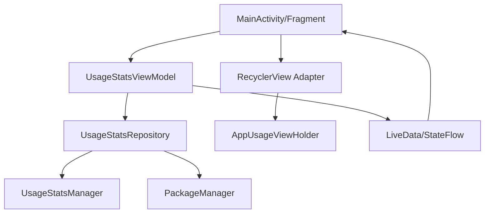

# Design Document

## Overview

This design document outlines the architecture and implementation approach for enhancing the Android app usage statistics application. The enhancement adds total usage time display and improved time filtering functionality using Android's UsageStatsManager API.

The solution follows Android's MVVM architecture pattern with Repository pattern for data access, ensuring clean separation of concerns and testability.

## Architecture

### High-Level Architecture



### Component Responsibilities

- **MainActivity/Fragment**: UI layer handling user interactions and displaying data
- **UsageStatsViewModel**: Business logic and state management
- **UsageStatsRepository**: Data access layer abstracting UsageStatsManager operations
- **RecyclerView Adapter**: Efficient list rendering with ViewHolder pattern
- **UsageStatsManager**: Android system service for usage data
- **PackageManager**: Android service for app metadata (icons, names)

## Components and Interfaces

### 1. Data Models

```kotlin
data class AppUsageInfo(
    val packageName: String,
    val appName: String,
    val icon: Drawable?,
    val lastTimeUsed: Long,
    val totalTimeInForeground: Long
)

enum class TimeFilter(val displayName: String, val days: Int) {
    DAILY("Daily", 1),
    WEEKLY("Weekly", 7),
    MONTHLY("Monthly", 30),
    YEARLY("Yearly", 365)
}

sealed class UsageStatsState {
    object Loading : UsageStatsState()
    data class Success(val apps: List<AppUsageInfo>) : UsageStatsState()
    data class Error(val message: String) : UsageStatsState()
    object PermissionRequired : UsageStatsState()
}
```

### 2. Repository Interface

```kotlin
interface UsageStatsRepository {
    suspend fun getUsageStats(timeFilter: TimeFilter): Result<List<AppUsageInfo>>
    fun hasUsageStatsPermission(): Boolean
    suspend fun getAppInfo(packageName: String): AppInfo?
}
```

### 3. ViewModel Interface

```kotlin
class UsageStatsViewModel : ViewModel() {
    private val _uiState = MutableStateFlow<UsageStatsState>(UsageStatsState.Loading)
    val uiState: StateFlow<UsageStatsState> = _uiState.asStateFlow()
    
    private val _selectedFilter = MutableStateFlow(TimeFilter.DAILY)
    val selectedFilter: StateFlow<TimeFilter> = _selectedFilter.asStateFlow()
    
    fun loadUsageStats(filter: TimeFilter)
    fun refreshData()
    fun checkPermissions()
}
```

### 4. UI Components

#### RecyclerView Adapter
```kotlin
class AppUsageAdapter : RecyclerView.Adapter<AppUsageViewHolder>() {
    private var apps: List<AppUsageInfo> = emptyList()
    
    fun updateApps(newApps: List<AppUsageInfo>)
    override fun onCreateViewHolder(parent: ViewGroup, viewType: Int): AppUsageViewHolder
    override fun onBindViewHolder(holder: AppUsageViewHolder, position: Int)
}
```

#### ViewHolder
```kotlin
class AppUsageViewHolder(itemView: View) : RecyclerView.ViewHolder(itemView) {
    fun bind(appUsageInfo: AppUsageInfo)
    private fun formatUsageTime(timeInMillis: Long): String
}
```

## Data Models

### UsageStats Data Processing

The system will process raw UsageStats data through the following pipeline:

1. **Time Range Calculation**: Calculate start and end timestamps based on selected filter
2. **Data Aggregation**: Sum up usage times for apps with multiple usage sessions
3. **App Metadata Enrichment**: Fetch app names and icons using PackageManager
4. **Sorting**: Order by total usage time (descending), then by last used time
5. **Filtering**: Remove system apps and apps with zero usage (optional)

### Time Formatting Logic

```kotlin
fun formatUsageTime(timeInMillis: Long): String {
    val seconds = timeInMillis / 1000
    return when {
        seconds < 60 -> "${seconds}s"
        seconds < 3600 -> "${seconds / 60}m"
        else -> {
            val hours = seconds / 3600
            val minutes = (seconds % 3600) / 60
            if (minutes > 0) "${hours}h ${minutes}m" else "${hours}h"
        }
    }
}
```

## Error Handling

### Permission Handling Strategy

1. **Check Permission**: Use `AppOpsManager` to verify usage access permission
2. **Request Permission**: Guide user to Settings app to grant permission
3. **Handle Denial**: Show informative message with retry option
4. **Auto-refresh**: Automatically reload data when returning from Settings

### Error States

- **No Permission**: Show permission request UI with Settings button
- **No Data**: Display empty state with refresh option
- **System Error**: Show generic error message with retry functionality
- **Loading State**: Display skeleton loading animation

### Exception Handling

```kotlin
try {
    val usageStats = usageStatsManager.queryUsageStats(...)
    // Process data
} catch (SecurityException e) {
    // Handle permission issues
    emit(UsageStatsState.PermissionRequired)
} catch (Exception e) {
    // Handle other errors
    emit(UsageStatsState.Error("Failed to load usage data"))
}
```

## Performance Optimization Strategy

### Memory Management

1. **Object Pooling**: Reuse ViewHolder objects in RecyclerView for smooth scrolling
2. **Bitmap Caching**: Implement LRU cache for app icons to reduce memory pressure
3. **Data Pagination**: Load usage data in chunks for devices with 100+ apps
4. **Weak References**: Use weak references for cached app metadata to prevent memory leaks

### Background Processing

```kotlin
class UsageStatsRepository {
    private val backgroundDispatcher = Dispatchers.IO
    private val appInfoCache = LruCache<String, AppInfo>(100)
    
    suspend fun getUsageStats(timeFilter: TimeFilter): Result<List<AppUsageInfo>> = 
        withContext(backgroundDispatcher) {
            // Heavy processing on background thread
            val usageStats = queryUsageStatsFromSystem(timeFilter)
            val processedData = processAndAggregateData(usageStats)
            processedData.map { enrichWithAppInfo(it) }
        }
}
```

### Caching Strategy

1. **App Metadata Cache**: Cache app names and icons with 24-hour TTL
2. **Usage Data Cache**: Cache recent usage queries for 5 minutes to handle rapid filter switches
3. **Icon Cache**: Use Glide or similar library for efficient image loading and caching
4. **Persistent Cache**: Store frequently accessed data in SharedPreferences or Room database

### UI Performance

1. **RecyclerView Optimization**: 
   - Use `setHasFixedSize(true)` for consistent item sizes
   - Implement `DiffUtil` for efficient list updates
   - Use `setItemViewCacheSize()` to optimize scrolling

2. **Lazy Loading**: Load app icons asynchronously using coroutines
3. **View Recycling**: Minimize view inflation by reusing existing views
4. **Smooth Animations**: Use `notifyItemChanged()` instead of `notifyDataSetChanged()`

### Data Processing Optimization

```kotlin
// Efficient data aggregation
private fun aggregateUsageStats(stats: List<UsageStats>): Map<String, Long> {
    return stats.groupBy { it.packageName }
        .mapValues { (_, usageList) -> 
            usageList.sumOf { it.totalTimeInForeground }
        }
}

// Batch app info retrieval
private suspend fun batchGetAppInfo(packageNames: List<String>): Map<String, AppInfo> {
    return packageNames.chunked(20) // Process in batches
        .flatMap { batch ->
            batch.mapNotNull { packageName ->
                appInfoCache[packageName] ?: getAppInfoFromSystem(packageName)?.also {
                    appInfoCache.put(packageName, it)
                }
            }
        }.associateBy { it.packageName }
}
```

## Implementation Considerations

### Advanced Performance Optimizations

1. **Coroutine-based Architecture**: Use structured concurrency for non-blocking operations

### System Resource Management

```kotlin
class PerformanceOptimizedRepository {
    private val usageStatsCache = ConcurrentHashMap<TimeFilter, CachedData>()
    private val iconCache = LruCache<String, Drawable>(50)
    private val coroutineScope = CoroutineScope(SupervisorJob() + Dispatchers.IO)
    
    // Debounced filter changes
    private val filterChangeFlow = MutableSharedFlow<TimeFilter>()
    
    init {
        filterChangeFlow
            .debounce(300)
            .distinctUntilChanged()
            .onEach { filter -> loadUsageStats(filter) }
            .launchIn(coroutineScope)
    }
}
```

### Android API Considerations

1. **API Level**: UsageStatsManager requires API 21+ (Android 5.0)
2. **Permission Model**: Usage access is a special permission requiring user action
3. **Data Availability**: Usage data may not be immediately available after permission grant
4. **System Apps**: Consider filtering out system apps for better user experience

### UI/UX Considerations

1. **Loading States**: Show skeleton loading for better perceived performance
2. **Empty States**: Provide helpful messages when no data is available
3. **Accessibility**: Ensure proper content descriptions for screen readers
4. **Material Design**: Follow Material Design guidelines for consistent UI