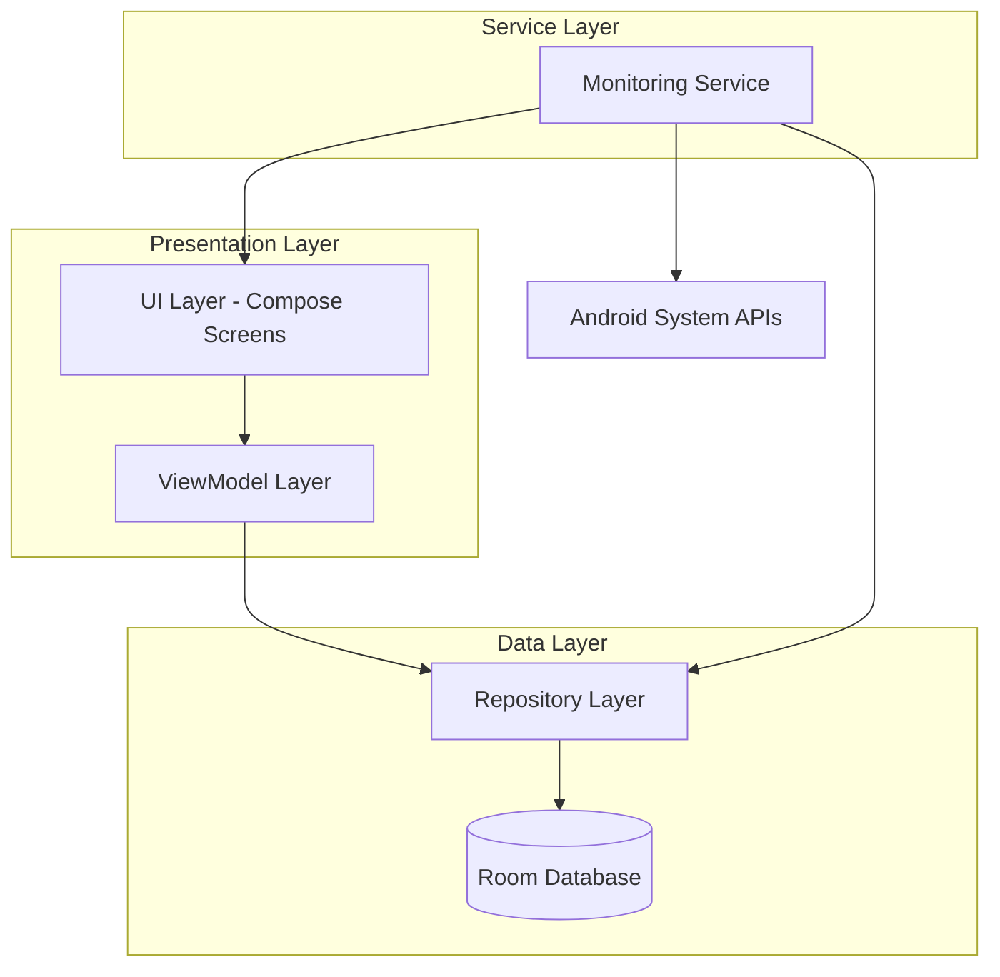
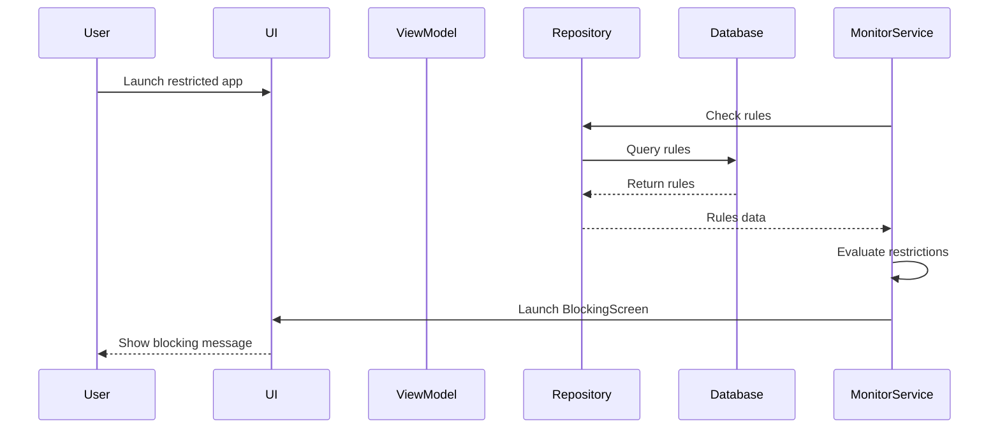

# Design Document

## Overview

The App Usage Restriction feature extends the existing Mobile Monitor application to provide comprehensive app usage control capabilities. The system will monitor app launches in real-time, enforce user-defined restrictions based on time periods and usage patterns, and provide a rich UI for managing these restrictions.

The architecture follows Android best practices with a clear separation between data, domain, and presentation layers. The feature integrates with Android's UsageStatsManager for tracking and implements a foreground service for real-time app launch monitoring. All restriction rules are persisted in a local Room database.

Key technical components:
- **Room Database**: Persistent storage for app information and usage rules
- **Foreground Service**: Background monitoring with accessibility service integration
- **Jetpack Compose UI**: Modern declarative UI for all screens
- **Jetpack Navigation**: Type-safe navigation between screens
- **ViewModel Architecture**: State management and business logic

## Architecture

### High-Level Architecture



### Component Interaction Flow



## Components and Interfaces

### 1. Database Layer (Room)

#### AppInfoEntity
```kotlin
@Entity(tableName = "app_info")
data class AppInfoEntity(
    @PrimaryKey(autoGenerate = true)
    val id: Long = 0,
    
    @ColumnInfo(name = "app_name")
    val appName: String,
    
    @ColumnInfo(name = "package_name")
    val packageName: String,
    
    @ColumnInfo(name = "enabled")
    val enabled: Boolean = true,
    
    @ColumnInfo(name = "created_time")
    val createdTime: Long = System.currentTimeMillis()
)
```

#### AppRuleEntity
```kotlin
@Entity(
    tableName = "app_rule",
    foreignKeys = [
        ForeignKey(
            entity = AppInfoEntity::class,
            parentColumns = ["id"],
            childColumns = ["app_info_id"],
            onDelete = ForeignKey.CASCADE
        )
    ],
    indices = [Index("app_info_id")]
)
data class AppRuleEntity(
    @PrimaryKey(autoGenerate = true)
    val id: Long = 0,
    
    @ColumnInfo(name = "day")
    val day: Int, // 1-7 for Monday-Sunday
    
    @ColumnInfo(name = "time_range_start")
    val timeRangeStart: String, // HH:mm format
    
    @ColumnInfo(name = "time_range_end")
    val timeRangeEnd: String, // HH:mm format
    
    @ColumnInfo(name = "total_time")
    val totalTime: Int, // minutes
    
    @ColumnInfo(name = "total_count")
    val totalCount: Int,
    
    @ColumnInfo(name = "created_time")
    val createdTime: Long = System.currentTimeMillis(),
    
    @ColumnInfo(name = "app_info_id")
    val appInfoId: Long
)
```

#### DAOs

```kotlin
@Dao
interface AppInfoDao {
    @Query("SELECT * FROM app_info")
    fun getAllApps(): Flow<List<AppInfoEntity>>
    
    @Query("SELECT * FROM app_info WHERE id = :appId")
    suspend fun getAppById(appId: Long): AppInfoEntity?
    
    @Query("SELECT * FROM app_info WHERE package_name = :packageName")
    suspend fun getAppByPackageName(packageName: String): AppInfoEntity?
    
    @Insert(onConflict = OnConflictStrategy.REPLACE)
    suspend fun insertApp(app: AppInfoEntity): Long
    
    @Update
    suspend fun updateApp(app: AppInfoEntity)
    
    @Delete
    suspend fun deleteApp(app: AppInfoEntity)
}

@Dao
interface AppRuleDao {
    @Query("SELECT * FROM app_rule WHERE app_info_id = :appId")
    fun getRulesForApp(appId: Long): Flow<List<AppRuleEntity>>
    
    @Query("SELECT * FROM app_rule WHERE id = :ruleId")
    suspend fun getRuleById(ruleId: Long): AppRuleEntity?
    
    @Query("""
        SELECT ar.* FROM app_rule ar
        INNER JOIN app_info ai ON ar.app_info_id = ai.id
        WHERE ai.enabled = 1
    """)
    suspend fun getAllEnabledRules(): List<AppRuleEntity>
    
    @Insert
    suspend fun insertRule(rule: AppRuleEntity): Long
    
    @Insert
    suspend fun insertRules(rules: List<AppRuleEntity>)
    
    @Update
    suspend fun updateRule(rule: AppRuleEntity)
    
    @Delete
    suspend fun deleteRule(rule: AppRuleEntity)
}
```

### 2. Repository Layer

#### AppRestrictionRepository
```kotlin
interface AppRestrictionRepository {
    // App operations
    fun getAllApps(): Flow<List<AppInfo>>
    suspend fun getAppById(appId: Long): AppInfo?
    suspend fun getAppByPackageName(packageName: String): AppInfo?
    suspend fun saveApp(app: AppInfo): Long
    suspend fun updateAppEnabled(appId: Long, enabled: Boolean)
    suspend fun deleteApp(appId: Long)
    
    // Rule operations
    fun getRulesForApp(appId: Long): Flow<List<AppRule>>
    suspend fun getRuleById(ruleId: Long): AppRule?
    suspend fun getAllEnabledRules(): List<AppRule>
    suspend fun saveRule(rule: AppRule): Long
    suspend fun saveRules(rules: List<AppRule>)
    suspend fun updateRule(rule: AppRule)
    suspend fun deleteRule(ruleId: Long)
    
    // Monitoring operations
    suspend fun checkRestriction(packageName: String): RestrictionResult
}
```

### 3. Domain Models

```kotlin
data class AppInfo(
    val id: Long = 0,
    val appName: String,
    val packageName: String,
    val enabled: Boolean = true,
    val icon: Drawable? = null,
    val lastTimeUsed: Long = 0,
    val totalTimeInForeground: Long = 0,
    val createdTime: Long = System.currentTimeMillis()
)

data class AppRule(
    val id: Long = 0,
    val day: DayOfWeek,
    val timeRangeStart: LocalTime,
    val timeRangeEnd: LocalTime,
    val totalTime: Int, // minutes
    val totalCount: Int,
    val appInfoId: Long,
    val createdTime: Long = System.currentTimeMillis()
)

enum class DayOfWeek(val value: Int) {
    MONDAY(1), TUESDAY(2), WEDNESDAY(3), THURSDAY(4),
    FRIDAY(5), SATURDAY(6), SUNDAY(7)
}

enum class DayPattern {
    WORKDAY, WEEKEND, CUSTOM
}

data class RestrictionResult(
    val isRestricted: Boolean,
    val appName: String,
    val violatedRule: AppRule?,
    val currentUsageTime: Int, // minutes
    val currentUsageCount: Int
)
```

### 4. Monitoring Service

#### AppMonitoringService
```kotlin
class AppMonitoringService : AccessibilityService() {
    private lateinit var repository: AppRestrictionRepository
    private val rulesCache = ConcurrentHashMap<String, List<AppRule>>()
    private val usageTracker = UsageTracker()
    
    override fun onServiceConnected() {
        // Initialize service
        loadRulesIntoCache()
    }
    
    override fun onAccessibilityEvent(event: AccessibilityEvent) {
        if (event.eventType == AccessibilityEvent.TYPE_WINDOW_STATE_CHANGED) {
            val packageName = event.packageName?.toString() ?: return
            checkAndEnforceRestrictions(packageName)
        }
    }
    
    private suspend fun checkAndEnforceRestrictions(packageName: String) {
        val result = repository.checkRestriction(packageName)
        if (result.isRestricted) {
            launchBlockingScreen(result)
        }
    }
    
    private fun launchBlockingScreen(result: RestrictionResult) {
        val intent = Intent(this, BlockingActivity::class.java).apply {
            addFlags(Intent.FLAG_ACTIVITY_NEW_TASK)
            putExtra("RESTRICTION_RESULT", result)
        }
        startActivity(intent)
    }
    
    fun reloadRules() {
        CoroutineScope(Dispatchers.IO).launch {
            loadRulesIntoCache()
        }
    }
    
    private suspend fun loadRulesIntoCache() {
        val rules = repository.getAllEnabledRules()
        rulesCache.clear()
        rules.groupBy { it.appInfoId }.forEach { (appId, appRules) ->
            val app = repository.getAppById(appId)
            app?.let {
                rulesCache[it.packageName] = appRules
            }
        }
    }
}
```

### 5. UI Components

#### Navigation Graph
```kotlin
sealed class Screen(val route: String) {
    object Home : Screen("home")
    object AppDetail : Screen("app_detail/{appId}") {
        fun createRoute(appId: Long) = "app_detail/$appId"
    }
    object AddRule : Screen("add_rule/{appId}") {
        fun createRoute(appId: Long) = "add_rule/$appId"
    }
    object EditRule : Screen("edit_rule/{ruleId}") {
        fun createRoute(ruleId: Long) = "edit_rule/$ruleId"
    }
    object Settings : Screen("settings")
    object Blocking : Screen("blocking")
}
```

#### Screen Components

**HomeScreen**: Displays list of monitored apps
- Uses LazyColumn for app list
- Shows app icon, name, package name, usage stats
- Navigates to AppDetailScreen on item click
- Settings icon in top app bar

**AppDetailScreen**: Shows app details and rules
- App information header
- Enable/disable toggle for the app
- LazyColumn for rules list
- SwipeToDismiss for rule deletion
- FAB for adding new rules

**AddRuleScreen**: Create new usage rules
- Day pattern selector (Workday/Weekend/Custom)
- Custom day picker (if custom selected)
- Time range picker (start/end time)
- Total time input (minutes)
- Total count input
- Save button

**EditRuleScreen**: Modify existing rule
- Pre-populated fields from existing rule
- Time range picker
- Total time input
- Total count input
- Save button

**SettingsScreen**: Global settings
- Monitoring enabled toggle
- Restart confirmation dialog

**BlockingScreen**: Shown when restriction violated
- App name that was blocked
- Current usage statistics
- Time period information
- Close button (returns to home)

## Data Models

### Database Schema

```sql
CREATE TABLE app_info (
    id INTEGER PRIMARY KEY AUTOINCREMENT,
    app_name TEXT NOT NULL,
    package_name TEXT NOT NULL UNIQUE,
    enabled INTEGER NOT NULL DEFAULT 1,
    created_time INTEGER NOT NULL
);

CREATE TABLE app_rule (
    id INTEGER PRIMARY KEY AUTOINCREMENT,
    day INTEGER NOT NULL,
    time_range_start TEXT NOT NULL,
    time_range_end TEXT NOT NULL,
    total_time INTEGER NOT NULL DEFAULT 0,
    total_count INTEGER NOT NULL DEFAULT 0,
    created_time INTEGER NOT NULL,
    app_info_id INTEGER NOT NULL,
    FOREIGN KEY (app_info_id) REFERENCES app_info(id) ON DELETE CASCADE
);

CREATE INDEX idx_app_rule_app_info_id ON app_rule(app_info_id);
```

### State Management

```kotlin
// Home Screen State
data class HomeUiState(
    val apps: List<AppInfo> = emptyList(),
    val isLoading: Boolean = false,
    val error: String? = null
)

// App Detail Screen State
data class AppDetailUiState(
    val app: AppInfo? = null,
    val rules: List<AppRule> = emptyList(),
    val isLoading: Boolean = false,
    val error: String? = null,
    val showDeleteDialog: Boolean = false,
    val ruleToDelete: AppRule? = null
)

// Rule Form State
data class RuleFormState(
    val dayPattern: DayPattern = DayPattern.WORKDAY,
    val selectedDays: Set<DayOfWeek> = emptySet(),
    val timeRangeStart: LocalTime = LocalTime.of(9, 0),
    val timeRangeEnd: LocalTime = LocalTime.of(17, 0),
    val totalTime: Int = 0,
    val totalCount: Int = 0,
    val isValid: Boolean = false,
    val errorMessage: String? = null
)

// Settings State
data class SettingsUiState(
    val monitoringEnabled: Boolean = true,
    val showRestartDialog: Boolean = false
)
```

## Correctness Properties

*A property is a characteristic or behavior that should hold true across all valid executions of a system—essentially, a formal statement about what the system should do. Properties serve as the bridge between human-readable specifications and machine-verifiable correctness guarantees.*

### Property 1: Blocking screen displays complete restriction information
*For any* restriction violation, the blocking screen should display the app name, time period, access count, and access duration for the current restriction period.
**Validates: Requirements 1.2, 1.3**

### Property 2: Rules are loaded into service cache
*For any* set of enabled rules in the database, after the monitoring service loads rules, all those rules should be present in the service's in-memory cache indexed by package name.
**Validates: Requirements 2.2**

### Property 3: Disabled apps are not restricted
*For any* app with enabled=false, the monitoring service should not enforce any usage rules for that app, regardless of rule violations.
**Validates: Requirements 2.4, 2.5, 10.5**

### Property 4: Rule evaluation checks all factors
*For any* app launch, the monitoring service should evaluate package name, enabled status, day pattern, time range, total duration, and access count before determining if restrictions apply.
**Validates: Requirements 2.7**

### Property 5: Required fields are validated
*For any* usage rule creation attempt, the system should reject rules that lack day pattern or time range specifications.
**Validates: Requirements 3.1**

### Property 6: Workday pattern creates five rules
*For any* time range and restriction values, selecting the workday pattern should create exactly five rules with identical settings for Monday through Friday.
**Validates: Requirements 3.5**

### Property 7: Weekend pattern creates two rules
*For any* time range and restriction values, selecting the weekend pattern should create exactly two rules with identical settings for Saturday and Sunday.
**Validates: Requirements 3.6**

### Property 8: Custom pattern creates rules for selected days
*For any* set of selected days, the custom pattern should create exactly one rule per selected day with identical time ranges and restrictions.
**Validates: Requirements 3.7**

### Property 9: Multiple rules per day are allowed
*For any* day of the week, the system should allow saving multiple rules with different time ranges for that same day.
**Validates: Requirements 3.8**

### Property 10: Database persistence round-trip
*For any* app info or rule, after saving to the database and retrieving it, all fields should have identical values to the original.
**Validates: Requirements 4.2, 4.4, 4.6**

### Property 11: Referential integrity is maintained
*For any* app deletion, all associated rules should be automatically deleted, and no orphaned rules should exist in the database.
**Validates: Requirements 4.5**

### Property 12: All apps are displayed on home screen
*For any* set of apps in the database, the home screen should display all apps with their icon, package name, app name, usage duration, and last opened time.
**Validates: Requirements 5.1, 5.2**

### Property 13: App detail screen shows complete information
*For any* app, the detail screen should display the app icon, package name, app name, usage duration, last opened time, and all associated rules with their day, time_range, total_time, and total_count.
**Validates: Requirements 6.1, 6.2, 6.4, 6.5**

### Property 14: Rule deletion removes from database
*For any* rule, after confirming deletion, the rule should no longer exist in the database or appear in any UI lists.
**Validates: Requirements 6.8**

### Property 15: Rule persistence maintains app association
*For any* new rule saved with an app_info_id, querying the database should return that rule associated with the correct app.
**Validates: Requirements 7.6**

### Property 16: Service reloads after rule changes
*For any* rule creation, update, or app enabled toggle, the monitoring service should reload its rules cache to reflect the changes.
**Validates: Requirements 7.7, 8.5, 10.3**

### Property 17: Edit screen loads correct rule data
*For any* rule being edited, the edit screen should display the current values of time_range, total_time, and total_count from the database.
**Validates: Requirements 8.1**

### Property 18: Invalid rule inputs are rejected
*For any* rule modification with invalid values (e.g., end time before start time, negative counts), the system should reject the save operation.
**Validates: Requirements 8.3**

### Property 19: Rule updates persist to database
*For any* rule modification, after saving, querying the database should return the updated values.
**Validates: Requirements 8.4**

### Property 20: Navigation parameters are preserved
*For any* navigation with parameters (app ID, rule ID), the destination screen should receive the correct parameter values.
**Validates: Requirements 9.3**

### Property 21: App enabled toggle updates database
*For any* app, toggling the enabled state should update the enabled field in the database to match the toggle state.
**Validates: Requirements 10.2**

### Property 22: Disabled apps have visual indication
*For any* app with enabled=false, the app detail screen should display visual styling that indicates the disabled state.
**Validates: Requirements 10.4**

### Property 23: Global monitoring preference persists
*For any* monitoring toggle change that is confirmed, the preference should persist across app restarts.
**Validates: Requirements 11.5**

### Property 24: Global disable prevents all restrictions
*For any* app launch when global monitoring is disabled, no restrictions should be enforced regardless of rules.
**Validates: Requirements 11.7**

### Property 25: Global enable enforces all active rules
*For any* app launch when global monitoring is enabled, all applicable rules for enabled apps should be evaluated and enforced.
**Validates: Requirements 11.8**

## Error Handling

### Database Errors
- **Connection Failures**: Retry with exponential backoff, show error UI if persistent
- **Constraint Violations**: Validate data before insertion, show user-friendly error messages
- **Migration Failures**: Implement fallback strategies, preserve user data

### Service Errors
- **Service Crash**: Implement service restart mechanism with WorkManager
- **Permission Denied**: Show permission request UI with explanation
- **Rule Evaluation Timeout**: Log error, allow app launch to prevent system freeze

### UI Errors
- **Invalid Input**: Show inline validation errors before save attempt
- **Navigation Failures**: Log error, return to home screen
- **State Inconsistency**: Reload data from database, show loading indicator

### Usage Tracking Errors
- **UsageStatsManager Unavailable**: Gracefully degrade, show warning to user
- **Time Calculation Errors**: Use safe defaults, log for debugging

## Testing Strategy

### Unit Testing

The feature will use JUnit 4 and MockK for unit testing. Unit tests will focus on:

- **Repository Layer**: Test database operations with in-memory Room database
- **ViewModel Logic**: Test state management and business logic with mocked repositories
- **Rule Evaluation**: Test restriction checking logic with various rule combinations
- **Time Calculations**: Test time range matching and usage tracking
- **Data Validation**: Test input validation for rules and app info

Example unit tests:
- Repository correctly saves and retrieves app info
- ViewModel updates UI state when rules are loaded
- Rule evaluator correctly identifies violations
- Time range checker handles edge cases (midnight crossing, etc.)
- Validation rejects invalid time ranges

### Property-Based Testing

The feature will use Kotest Property Testing for Android. Property-based tests will verify universal properties across many randomly generated inputs. Each property-based test will run a minimum of 100 iterations.

**Configuration**:
```kotlin
dependencies {
    testImplementation("io.kotest:kotest-runner-junit5:5.8.0")
    testImplementation("io.kotest:kotest-assertions-core:5.8.0")
    testImplementation("io.kotest:kotest-property:5.8.0")
}
```

**Property Test Requirements**:
- Each property-based test MUST be tagged with a comment referencing the design document property
- Tag format: `// Feature: app-usage-restriction, Property {number}: {property_text}`
- Each correctness property MUST be implemented by a SINGLE property-based test
- Tests MUST run at least 100 iterations to ensure thorough coverage

**Property Tests to Implement**:

1. **Property 1**: Generate random restriction results, verify blocking screen contains all required fields
2. **Property 2**: Generate random rule sets, verify all appear in service cache after loading
3. **Property 3**: Generate random apps with enabled=false, verify no restrictions enforced
4. **Property 6**: Generate random time ranges, verify workday creates 5 rules for Mon-Fri
5. **Property 7**: Generate random time ranges, verify weekend creates 2 rules for Sat-Sun
6. **Property 8**: Generate random day selections, verify custom creates correct number of rules
7. **Property 9**: Generate multiple rules for same day, verify all are saved
8. **Property 10**: Generate random app/rule data, verify save-then-load returns identical values
9. **Property 11**: Generate random apps with rules, verify deleting app deletes all rules
10. **Property 12**: Generate random app sets, verify all appear on home screen with correct data
11. **Property 13**: Generate random apps with rules, verify detail screen shows all information
12. **Property 14**: Generate random rules, verify deletion removes from database
13. **Property 15**: Generate random rules with app associations, verify correct linking
14. **Property 16**: Generate rule changes, verify service cache is updated
15. **Property 18**: Generate invalid rule inputs, verify rejection
16. **Property 19**: Generate rule modifications, verify updates persist
17. **Property 20**: Generate navigation with random parameters, verify correct delivery
18. **Property 21**: Generate toggle operations, verify database updates
19. **Property 23**: Generate monitoring preference changes, verify persistence
20. **Property 24**: Generate app launches with monitoring disabled, verify no restrictions
21. **Property 25**: Generate app launches with monitoring enabled, verify restrictions enforced

### Integration Testing

Integration tests will use Android Instrumentation Testing to verify:
- Database migrations work correctly
- Service communication with UI components
- Navigation flows between screens
- Accessibility service integration
- UsageStatsManager integration

### Test Utilities

Create test utilities for:
- Generating random app info and rules
- Creating test database instances
- Mocking Android system services
- Simulating time progression
- Creating test navigation controllers

## Implementation Notes

### Android Permissions Required
- `android.permission.PACKAGE_USAGE_STATS`: For tracking app usage
- `android.permission.BIND_ACCESSIBILITY_SERVICE`: For monitoring app launches
- `android.permission.FOREGROUND_SERVICE`: For background monitoring

### Performance Considerations
- Rule cache in memory to achieve <100ms evaluation time
- Database queries on background threads
- Lazy loading for app icons
- Efficient list rendering with LazyColumn

### Accessibility Service Configuration
```xml
<accessibility-service
    android:accessibilityEventTypes="typeWindowStateChanged"
    android:accessibilityFeedbackType="feedbackGeneric"
    android:accessibilityFlags="flagDefault"
    android:canRetrieveWindowContent="false"
    android:notificationTimeout="100" />
```

### Database Migration Strategy
- Use Room's auto-migration where possible
- Implement manual migrations for complex schema changes
- Test migrations with real user data scenarios
- Maintain backward compatibility for at least 2 versions

### State Persistence
- Use SharedPreferences for global monitoring toggle
- Use Room database for all app and rule data
- Implement ViewModel SavedStateHandle for UI state
- Handle process death gracefully

### Dependency Injection
Consider using Hilt for dependency injection to:
- Provide repository instances to ViewModels
- Inject database and service dependencies
- Simplify testing with test modules
- Manage service lifecycle

### Navigation Library
Use Jetpack Navigation Compose for:
- Type-safe navigation with arguments
- Deep linking support
- Back stack management
- Transition animations
